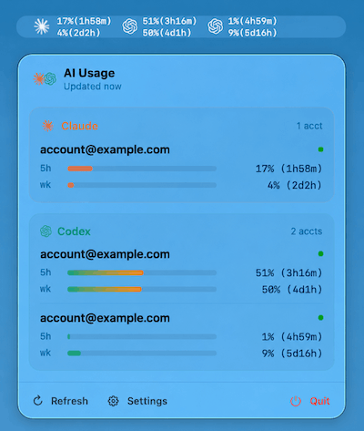

# AI Usage Check

A native macOS menubar app that shows live **5-hour and 7-day quota
utilization** for both **Claude Code** (Pro/Max) and **Codex CLI**
(ChatGPT Plus/Pro). Multi-account.

<p align="center">
  
</p>

## Download

Pre-built DMGs are attached to every [GitHub Release](https://github.com/hsoxo/cli-usage-check/releases).
Builds are ad-hoc signed only — Gatekeeper will block them on first
launch. Right-click → Open, or strip the quarantine bit:

```sh
xattr -dr com.apple.quarantine "/Applications/AI Usage Check.app"
```

## Requirements

- macOS 14 (Sonoma) or newer
- Swift 5.9+ toolchain (Xcode 15 / Command Line Tools)
- A **Claude Pro/Max** subscription and/or a **ChatGPT Plus/Pro**
  subscription. API-key-only auth does **not** expose the 5h/7d quotas
  this app reads.

## Build from source

```sh
# 1. Compile and bundle into a .app
bash scripts/build-app.sh

# 2. Launch
open "build/AI Usage Check.app"

# 3. Optional: copy to Applications
cp -R "build/AI Usage Check.app" /Applications/

# 4. Package as a DMG (optional)
bash scripts/build-dmg.sh 0.1.0
```

The build script runs `swift build -c release`, copies the binary into
a minimal `.app` bundle with `LSUIElement=YES` (no Dock icon, menubar
only), then ad-hoc codesigns it. No Xcode project required.

## First-run setup

1. Click the menu bar icon → **Open Settings…**
2. **Accounts** tab → **Add account**
3. Pick a provider, then either:
   - Click **Import from `~/.claude/.credentials.json`** (or the Codex
     equivalent) — the easiest path if you've already run
     `claude` / `codex login` on this machine, **or**
   - Paste an OAuth access token (and optionally a refresh token, so
     the app can silently renew when it expires)
4. Tick **Show in Menubar** on the accounts you want to surface in the
   tray. Untoggled accounts still appear in the popover.

> **Make sure Codex is using ChatGPT auth, not an API key.** Run
> `codex logout && codex login` and choose the ChatGPT browser flow.
> If `~/.codex/auth.json` only contains `OPENAI_API_KEY`, the app will
> tell you to switch.

## How it works

| Provider | Endpoint | Method |
|---|---|---|
| Claude   | `POST https://api.anthropic.com/v1/messages` | Send a 1-token `claude-haiku-4-5-20251001` probe; read `anthropic-ratelimit-unified-{5h,7d}-{utilization,reset}` response headers |
| Codex    | `GET https://chatgpt.com/backend-api/wham/usage` | Parse `rate_limit.primary_window` (5h) and `rate_limit.secondary_window` (weekly) |

OAuth refresh:

| Provider | Refresh endpoint | client_id |
|---|---|---|
| Claude   | `POST https://platform.claude.com/v1/oauth/token` | `9d1c250a-e61b-44d9-88ed-5944d1962f5e` |
| Codex    | `POST https://auth.openai.com/oauth/token` | `app_EMoamEEZ73f0CkXaXp7hrann` |

Both endpoints are **reverse-engineered from the official CLIs** and
not officially documented. They may change without notice. If your
account stops fetching, sign out / in to the official CLI and
re-import.

## File layout

```
ai-usage-check/
├── Package.swift                  # Swift Package, executable target
├── Resources/Info.plist           # LSUIElement=YES, bundle metadata
├── scripts/
│   ├── build-app.sh               # SPM build → .app bundle wrapper
│   └── build-dmg.sh               # .app → distributable DMG
├── .github/workflows/
│   ├── ci.yml                     # build verification on PR / main
│   └── release.yml                # tag push (v*) → DMG → GitHub Release
└── Sources/AIUsageCheck/
    ├── App.swift                  # @main, MenuBarExtra + Settings scenes
    ├── Models/                    # Provider, Account, OAuthTokens, UsageSnapshot
    ├── Auth/                      # TokenStore, AccountStore, ClaudeAuth, CodexAuth
    ├── Clients/                   # ClaudeClient (header probe), CodexClient (/wham/usage)
    ├── Importers/                 # CLIImporter — reads ~/.claude & ~/.codex
    ├── Polling/                   # UsagePoller (configurable interval)
    ├── State/                     # AppState (ObservableObject)
    ├── Settings/                  # Preferences (UserDefaults)
    ├── Util/                      # Log, Formatting, PKCE
    └── Views/                     # MenuBarLabel, MenuBarContent, AccountRow, UsageBar, Settings/*
```

## Storage locations

- OAuth tokens: `~/Library/Application Support/AIUsageCheck/tokens.json` (`0600` perms)
- Account index: `~/Library/Application Support/AIUsageCheck/accounts.json`
- Preferences: `defaults read com.hhe.aiusagecheck` (poll interval, appearance)

## Settings

- **Polling**: 30 s – 60 min, default **120 s**. Each Claude poll
  burns ~1 token (~$0.0001 on haiku); Codex polls don't bill against
  your quota.
- **Appearance**: System / Light / Dark theme for the popover. The
  Settings window always follows the system.
- **Launch at login**: registers via `SMAppService.mainApp`.
- **Show in Menubar** (per account): controls which accounts surface
  in the tray summary. All accounts always show in the popover.

## Releasing

Tag and push — the `release.yml` workflow builds the .app, packages a
DMG, computes SHA256, and creates a GitHub Release with both files
attached.

```sh
git tag v0.2.0
git push origin v0.2.0
```

## Caveats

- **Reverse-engineered endpoints.** Treat them as best-effort.
- **Cloudflare**. The `/wham/usage` endpoint goes through CF.
  If you see 403s, run the official `codex` CLI once to seed CF
  cookies, then retry.
- **No code signing** beyond ad-hoc. To distribute outside your own
  Mac without the Gatekeeper warning you'd want a Developer ID cert
  and a notarization step.
